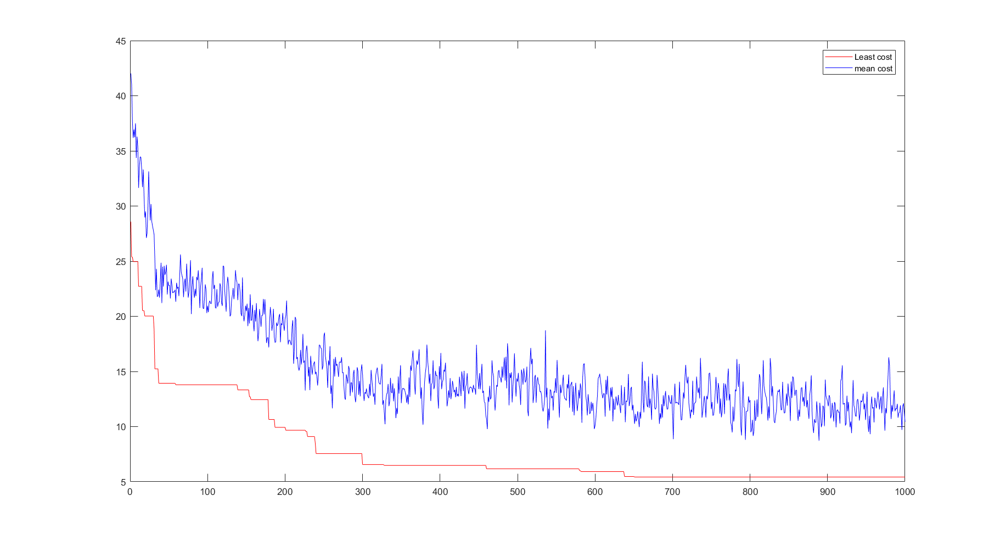
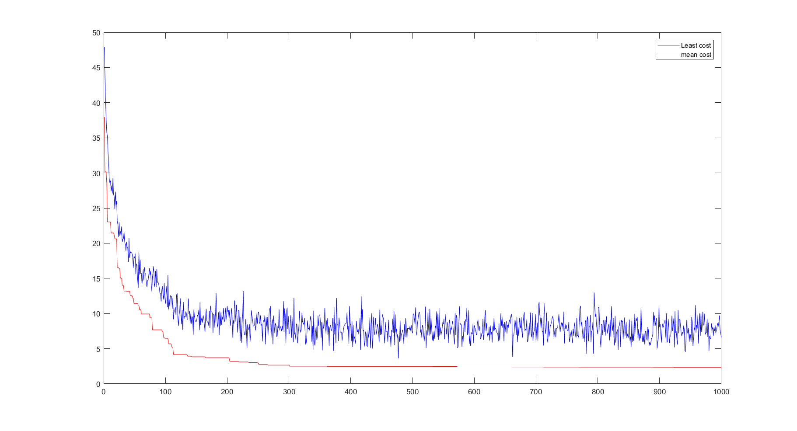

# Travelling Salesman Problem

* In this repository, Cities are created in 3D space and it can easily change to any dimention.
In the first aproach, children generated from all parents according to their probability (probability extraced from the cost)
you can see trends of this approach bellow:

* In the second approach, in generating new children, 10 top parents (with minimum cost) selected and then each children generate from one parent.
you can see trends of this approach bellow:
